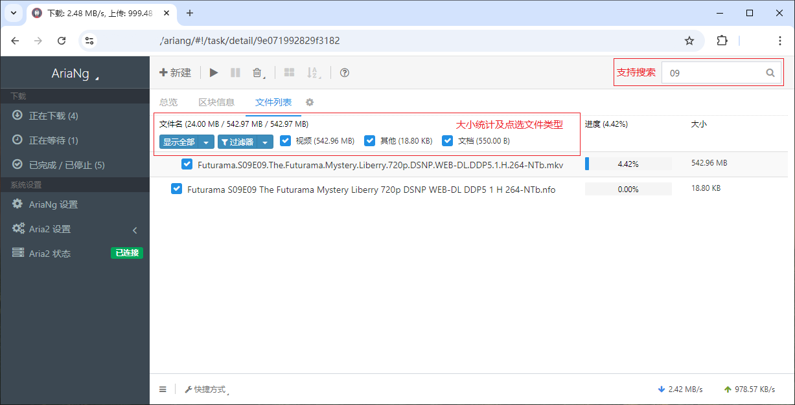

# AriaNgMod

[](https://github.com/jjling2011/AriaNgMod/blob/master/LICENSE)

AriaNgMod 是 [mayswind/AriaNg](https://github.com/mayswind/AriaNg) 的修改版。

修改内容：
 * 支持批量导入多个 BT 种子
 * 添加更易用的按扩展名选择文件的工具栏
 * 支持从大到小，按总大小百分比选择下载文件
 * 添加 "@" 特殊搜索前缀
 * 切换页面时清空搜索关键词

搜索示例：  
@8 表示搜索包含 8 个及以上文件，正在下载的任务。  
@8c 表示搜索包含 8 个及以上文件的所有任务。包括已经下载完成，但还在上传的任务。  
@8a 表示搜索包含 8 个及以上文件并且已经选中所有文件的任务。  
*注：a 和 c 可以组合使用*  

#### 在线使用（和代码同步更新）

[https://jjling2011.github.io/AriaNgMod/](https://jjling2011.github.io/AriaNgMod/)

  

#### 下载发布文件（不定期更新）

[https://github.com/jjling2011/AriaNgMod/releases](https://github.com/jjling2011/AriaNgMod/releases)

#### 开发

```bash
# 安装依赖
pnpm install

# 编译
pnpm run build

# 本地测试
pnpm run serve

# 生成 all-in-one 发布文件
pnpm run allinone
```

#### 更新记录
[logs.md](./docs/logs.md)
